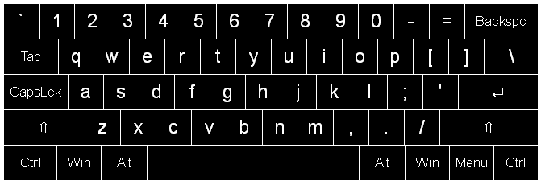

# Alexander Suvorov

---

**Python/Django architect. Full cycle: from architecture to production**

**Independent Cryptography Researcher & Security Developer**  
*Pioneering paradigms for passwordless authentication and zero-transmission communication through open-source innovation.*

---

 

---

## 🔭 Current Focus

Developing revolutionary open-source tools that challenge conventional security models:
- **Zero-Storage Authentication** - Deterministic password generation without credential storage
- **Zero-Transmission Communication** - Messaging protocols that transmit no message data
- **Cryptographic Paradigm Shifts** - From information creation to mathematical discovery

## 🛠️ Technical Expertise

### Development Domains
- **Web Applications** - Full-stack development with modern frameworks
- **Python Libraries** - Cryptographic foundations and security primitives  
- **CLI Tools** - Cross-platform command-line utilities
- **Desktop Applications** - Native GUI applications
- **Bot Development** - Telegram & VK integration platforms

## 🚀 Innovative Projects

### Security Ecosystem

*Deterministic password generation library*

*Zero-transmission messaging protocol*

*Console-based security utilities*

### Production Applications

*Django-based web interface*

*Cross-platform desktop application*

*Mobile-accessible password management*

---

## 📊 Open Source Presence

**Total Packages**: 25+  
**Monthly Downloads**: 5000+  

---

## 🎯 Career Objectives

Seeking challenging opportunities in:
- **Cryptography Research** - Novel security paradigms and implementations
- **Security Architecture** - Designing next-generation protection systems
- **Technical Innovation** - Solving complex problems with elegant solutions

---

## 📫 Let's Connect

---

## 🐧 Development Environment

**Primary OS**: Arch Linux ❤️  
**Philosophy**: Open Source, Privacy-First, Security by Design  
**Approach**: Research-Driven Development, Paradigm-Shifting Innovation

---

 

*"We don't create information—we discover mathematical truths that were always there."*

---

**Availability**: Open to consulting, research collaborations, and full-time positions  
**Location**: Remote / Worldwide  
**Status**: Actively seeking challenging opportunities in security innovation
